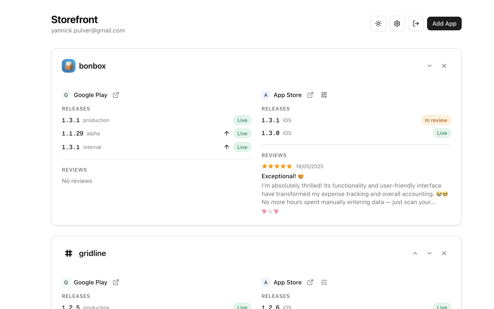

# Store Helper

[Live App](https://storefront-taupe-theta.vercel.app/)

Dashboard for managing app reviews, releases, and release statuses across **Google Play Store** and **Apple App Store**.



## Features

- **App Groups** — Link Google Play and Apple App Store apps into unified groups
- **Release Tracking** — Monitor release status across tracks/platforms (live, review, pending, issue, draft)
- **Reviews** — View recent reviews from both stores in one place
- **Multi-Platform** — Filter Apple releases by platform (iOS, macOS, tvOS, visionOS)
- **Encrypted Credentials** — Store API keys are encrypted at rest with AES-256-GCM
- **Dark Mode** — Full dark/light theme support

## Tech Stack

- **Framework**: Next.js 16, React 19, TypeScript
- **Auth**: Auth.js v5 (Google OAuth, JWT sessions)
- **Database**: Neon Postgres + Drizzle ORM
- **UI**: shadcn/ui, Tailwind CSS 4, Radix UI
- **Data Fetching**: SWR

## Setup

```bash
npm install
cp .env.example .env.local
```

### Environment Variables

| Variable | Description |
|---|---|
| `AUTH_GOOGLE_ID` | Google OAuth client ID |
| `AUTH_GOOGLE_SECRET` | Google OAuth client secret |
| `AUTH_SECRET` | Auth.js secret (random string) |
| `POSTGRES_URL` | Neon Postgres connection string |
| `ENCRYPTION_KEY` | 32-byte hex key for encrypting stored credentials |

### Store Credentials

Store API credentials are configured **in-app** via the Settings dialog (not env vars). They are encrypted and stored per-user in the database.

**Google Play Store**: Upload your Service Account JSON in Settings.

**Apple App Store Connect**: Enter your Issuer ID, Key ID, and Private Key (.p8 contents) in Settings.

## Development

```bash
npm run dev
```

Open [http://localhost:3000](http://localhost:3000).

### Database

```bash
npx drizzle-kit push    # apply schema to database
npx drizzle-kit studio  # browse data
```

## Changelog

See [CHANGELOG.md](CHANGELOG.md) for release history.

## Deploy

Set the environment variables in your hosting provider (e.g. Vercel), then deploy.
